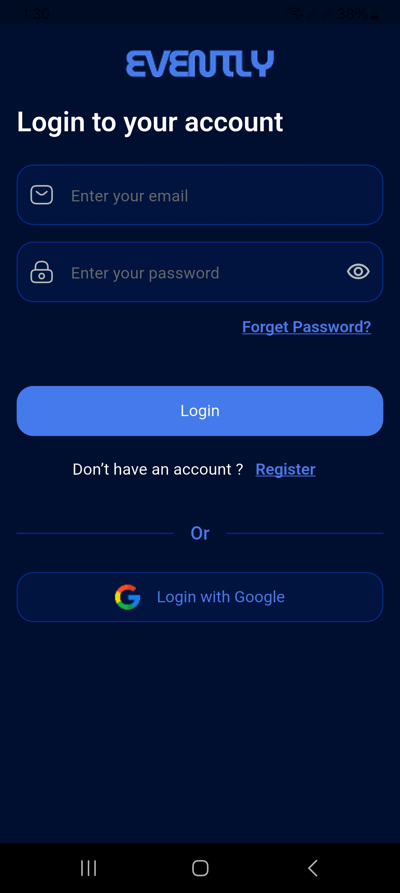
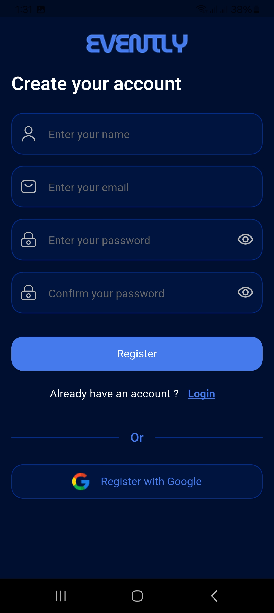
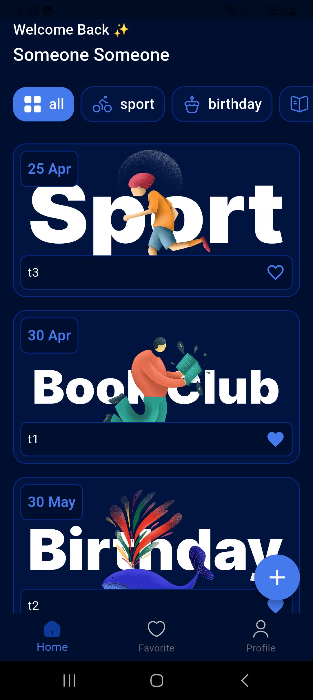
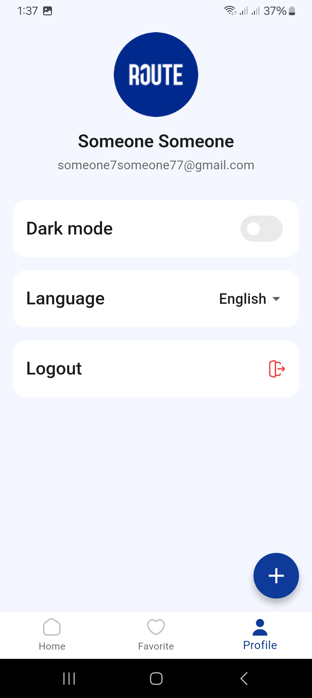
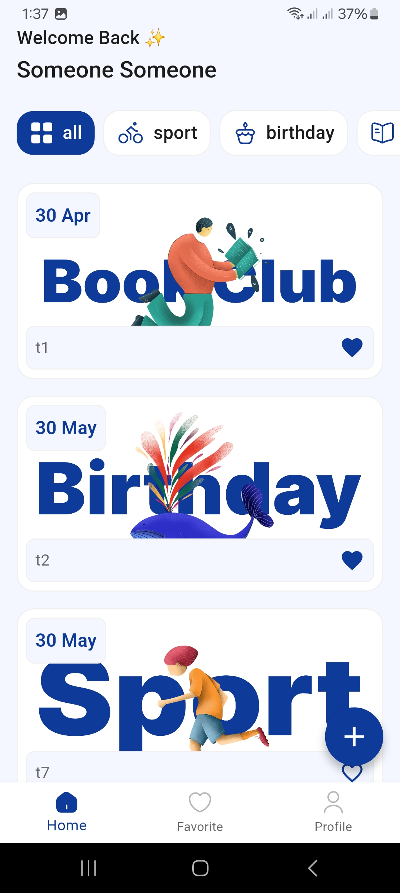

# 📱 Islami App

A modern Flutter application for creating, managing, and exploring events with a clean UI and seamless user experience.

---

## ✨ Features

🎉 Create, edit, and delete events  
📅 View all events sorted by time  
❤️ Add/remove events to favorites  
🔐 Authentication (Email & Google Sign-In)  
🌙 Light & Dark mode support  
🌍 Multi-language support (Localization)  
💾 Persistent login using SharedPreferences  
🔥 Firebase integration (Auth & Firestore)  
🧭 Intro/onboarding screens  

---

## 📸 Screenshots

<p align="center">
  
  
  
  
  
  
</p>

👉 More Screenshots:
https://drive.google.com/drive/folders/1O4PY65b7C491GeAkoe9k1gF07taQQURS

---

## 🎥 Demo Video

👉 Watch the app demo:
https://drive.google.com/file/d/12RjthJEfyT5UbID-7yi5-JuNF6Ugl2qp/view?usp=drive_link

---

## 📦 Download APK

👉 Get latest APK:
https://drive.google.com/file/d/1fdPVpv6vYjy3KJTJDeRki8I1tIC5Ew5h/view?usp=drive_link


---

## 🛠️ Tech Stack

- Flutter  
- Dart  
- Firebase (Auth + Firestore)  
- Provider (State Management)  
- SharedPreferences  
- Google Sign-In  
- Flutter Dotenv  

---

## 📁 Project Structure

```
lib/
├── auth/
├── eventScreens/
├── intro_screens/
├── models/
├── providers/
├── firebase_service.dart
├── home_screen.dart

assets/
├── images/
├── icons/
```

---

## ⚙️ Getting Started

1. Clone the repository:

```bash
git clone https://github.com/your-username/evently-app.git
```

2. Navigate to project folder:

```bash
cd evently-app
```

3. Install dependencies:

```bash
flutter pub get
```

4. Run the app:

```bash
flutter run
```

---

## 🎨 Assets

* Images: `assets/images/`
* Icons: `assets/icons/`
* Text files: `assets/texts/`

---

## 📱 App Icon & Splash

* Launcher icon configured via `flutter_launcher_icons`
* Splash screen via `flutter_native_splash`

---

## 👨‍💻 Author

Ahmed Abd El-Moniem

---

## 📄 License

This project is for educational purposes.
